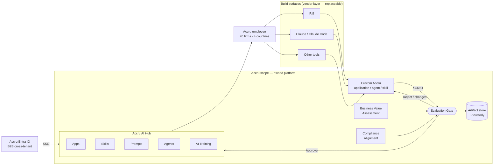

# Accru AI Hub — Technical Architecture Specification

**Version:** 0.2 (draft for review)
**Owner:** Head of AI, Accru Partners Group
**Status:** Proposed — pending scope approval
**Date:** 9 July 2026 (v0.2 revision — see Changelog, §15)

---

## 1. Purpose

The Accru AI Hub is the group's permanent, owned registry and distribution layer for AI assets: applications, agents, skills, prompts, and training. It is the one component in the AI stack that Accru builds and owns outright.

Everything above it is replaceable. Employees build in Riff today, in Claude today, in something else in three years. The Hub does not care. It is the place where the output of that work is catalogued, governed, versioned, discovered, and measured — and where the intellectual property lives when a vendor relationship ends.

**One-line definition:** a governed, multi-tenant catalogue of AI assets with a two-key approval gate, faceted taxonomy, and per-user relevance ranking, serving ~70 member firms across NO / SE / DK / UK from a single deployment.

---

## 2. Architectural principles

| # | Principle | Consequence |
|---|-----------|-------------|
| P1 | **Accru owns the IP** | Every published asset must have an exportable artifact archived in the Hub's artifact store. A live URL alone is not a deliverable. |
| P2 | **Vendor-neutral by construction** | Riff, Claude, and any future tool are *build surfaces*. They appear in the data model as `build_tool` metadata, never as structural components. The Hub's *own* AI dependencies (embedding, translation, summarisation, PII scanning) are likewise isolated behind swappable ports (§7.5) — the one model call the Hub itself makes must be replaceable by config, not rewrite. |
| P3 | **The Hub is a registry, not a host (initially)** | Apps run wherever they run. The Hub stores metadata, artifacts, entitlements, health, and telemetry, and launches the app. Hosting is a Phase 3 option, not a Phase 1 requirement. |
| P4 | **Open by default, ranked by relevance** | A UK accountant sees the whole catalogue. Country and firm affect *ordering and labelling*, not *permission*. Restriction is the exception and must be justified. |
| P5 | **Publishing is a gate, not a queue** | Nothing reaches the catalogue without passing business-value assessment and compliance alignment. Both, not either. |
| P6 | **Measure or it did not happen** | Every asset carries the four-stage funnel: discovered → launched → adopted → value realised. The **"Did this save you time today?" value report** (UX §7) is the primary group-wide AI-adoption instrument; analytics roll it up per country / firm / asset / **author** (§4.5) for exec reporting. |
| P7 | **Boring stack** | The Hub must be maintainable by an in-house team of two after the consultant leaves. No exotic dependencies. |

---

## 3. System context



**Reading the diagram:** the submitted artifact enters the gate; the gate is fed by two independent assessments; approval publishes into one of five asset classes and simultaneously commits the exportable artifact to Accru's own store. Rejection returns the asset to the builder with reason codes. The dotted boundary is what Accru owns.

---

## 4. Domain model

### 4.1 Core entities

**Organisation → Country → Firm → User.** One organisation. Four countries. ~70 firms. Users belong to exactly one firm; firms belong to exactly one country.

**Asset.** The central object. Five kinds, one table, kind-specific payload.

| Kind | What it is | Launch behaviour | Archived artifact |
|------|-----------|------------------|-------------------|
| `app` | Deployed web application (Riff-built or otherwise) | Redirect to production URL | Source export, or Riff project export + schema |
| `agent` | Configured agent template | Copy config / one-click deploy | Agent definition JSON (system prompt, tools, model, guardrails) |
| `skill` | Claude Skill or equivalent capability package | Download bundle / install to Enterprise | Skill folder (`SKILL.md` + assets), zipped |
| `prompt` | Reusable prompt or prompt chain | Copy to clipboard / open in Claude | Prompt text + variables + example I/O |
| `training` | Course, lab, or certification module | Open in training environment | Course content + assessments |

Rationale for one table: all five share the same lifecycle, taxonomy, review, telemetry, and rating surfaces. Only the payload and launch action differ. Splitting them multiplies the governance code fivefold for no benefit.

**AssetVersion.** Immutable. An asset's published state is a pointer to a version. New submission = new version. Approvals attach to versions, never to assets. This is what makes rollback and audit trivial.

**Submission.** A version awaiting or undergoing review. Carries the value case, the compliance questionnaire, and the reviewer decisions.

**Review.** One reviewer, one dimension (`value` or `compliance`), one decision, one scorecard, one comment thread.

### 4.2 Schema sketch

All tables carry `created_at` / `updated_at timestamptz` unless noted; `append-only` tables carry `occurred_at` only. Uniqueness and integrity constraints are called out inline because several of them are load-bearing (the two-key gate, one-rating-per-user, one-submission-per-version).

```
organisations(id, name)
countries(id, code)                       -- NO, SE, DK, UK
firms(id, country_id, name, entra_group_id)
firm_systems(firm_id, tag_id)             -- normalised: references the systems vocabulary, not free text
users(id, firm_id, entra_object_id UNIQUE, upn, email, display_name,
      role, job_family, certification_tier, default_scope jsonb,
      status,                              -- active | disabled  (soft-deactivate, never hard-delete)
      created_at, updated_at, last_seen_at, disabled_at)

assets(id, kind, slug UNIQUE, title, summary, description_md,
       author_user_id, author_firm_id,    -- PERMANENT credit for the original contributor (§4.5). Immutable.
       origin_country_id,                  -- the ONE country that made it (§4.3/§4.4). Defaults from author's firm.
       owner_user_id, owner_firm_id,       -- current accountable owner. CHANGES on reassignment/orphaning.
       current_version_id,                 -- DEFERRABLE FK -> asset_versions.id (circular; see §4.2 note)
       status,                             -- derived: draft|published|deprecated|orphaned|archived|revoked
       build_tool, visibility,             -- group|country|firm|private  (jurisdiction_scope removed; derived, see §6)
       visibility_reason, visibility_approved_by,   -- required when visibility <> 'group' (§4.3)
       created_at, updated_at, published_at, deprecated_at, orphaned_at)

asset_versions(id, asset_id, supersedes_id,   -- each resubmit is a NEW version; links to the one it replaces
               semver, payload jsonb, changelog_md,
               production_url, artifact_id, submitted_by,
               health_status,                 -- healthy|degraded|down
               consecutive_failures, last_probe_at, unlisted_at,
               last_reviewed_at, next_review_due_at,   -- recertification (§5.5), shown publicly (UX §7)
               submitted_at, published_at, state)       -- state = §5.1 machine
                                            -- optimistic-concurrency guard column `row_version` on transitions

artifacts(id, asset_version_id, storage_key, checksum, size_bytes,
          kind, license, export_verified_at)

asset_embeddings(asset_version_id, model_id, dim, vector,   -- side table: multiple models can coexist
                 embedding_input_text,      -- exact text embedded; source of truth for re-embedding (§7.5)
                 embedded_at)               -- PK(asset_version_id, model_id)

submissions(id, asset_version_id UNIQUE, value_case jsonb,
            compliance_answers jsonb, evidence jsonb, pii_findings jsonb,
            state, sla_due_at, escalated_at)   -- escalated_at makes escalation fire once (§5.3)

reviews(id, submission_id, reviewer_user_id, dimension,   -- UNIQUE(submission_id, dimension)
        decision, scorecard jsonb, reason_codes[], comment_md, decided_at)
        -- EXCLUDE (submission_id WITH =, reviewer_user_id WITH =): one person cannot hold both keys (§5.3)

categories(id, parent_id, name_en, name_no, name_sv, name_da, slug)   -- all four names non-null
asset_categories(asset_id, category_id)            -- indexed both directions (§4.4)
asset_visibility_countries(asset_id, country_id)   -- permitted set when visibility='country' (permission, NOT origin)
tags(id, name, type)                               -- system, task, model, language
asset_tags(asset_id, tag_id)

events(id, user_id, asset_id, version_id, type, occurred_at, props jsonb)   -- analytics; pseudonymised at 13mo
value_reports(id, asset_id, user_id, minutes_saved, frequency, note, reported_at)
ratings(id, asset_id, user_id, stars, review_md)   -- UNIQUE(asset_id, user_id)
saved_assets(user_id, asset_id, saved_at)          -- "My work -> Saved" (UX §4)
collections(id, title, curated_by, scope)          -- editorial rows on Home
collection_items(collection_id, asset_id, position)

asset_adoption(asset_id, launches_30d, firms_30d, users_30d, refreshed_at)   -- precomputed for ranking (§7.2, §12)

audit_log(id, occurred_at, actor_user_id, actor_role, action,   -- APPEND-ONLY, 7-year, tamper-evident (§9.4)
          entity_type, entity_id, before jsonb, after jsonb, rationale, request_id)

webhook_endpoints(id, url, secret, events[], active)
webhook_deliveries(id, endpoint_id, event_type, payload jsonb,
                   status, attempts, next_retry_at, idempotency_key, delivered_at)
```

Author vs owner is a deliberate split (§4.5): **author credit is permanent recognition; ownership is a rotating accountability.** When an asset is orphaned and reassigned (§5.5) the owner changes but the byline does not.

**Three integrity notes on this schema, each of which bites if ignored:**

- **The `assets ↔ asset_versions` cycle.** `assets.current_version_id` points at a version, which points back at the asset. Insert order is resolved with a `DEFERRABLE INITIALLY DEFERRED` FK. A partial unique index (`UNIQUE(asset_id) WHERE state='published'`) plus a service-layer invariant guarantees the pointer only ever addresses a published version of the same asset.
- **Three state fields, one owner each — never drift.** `submissions.state` is the review sub-process; `asset_versions.state` is the §5.1 lifecycle; `assets.status` is **derived** from the current published version (or `orphaned`/`deprecated`/`revoked`) and is not independently writable. This is documented so the three never disagree.
- **Immutability and the `changes_requested` loop.** "New submission = new version" (§4.1) is literal: a resubmit after `changes_requested` creates a **new immutable `asset_version` + new `submission`**, linked via `supersedes_id`. Versions are never amended in place — that is what keeps rollback and audit trivial.

### 4.3 Visibility vs. origin — the central design decision

These are two different axes and conflating them is the most common way this kind of platform fails.

**Visibility** (`assets.visibility`) is a permission. Four values:

- `group` — everyone in Accru. **The default. ~95% of assets.**
- `country` — restricted to one or more countries. Requires a written reason (typically a licensing constraint, not a jurisdiction one). The permitted set lives in `asset_visibility_countries`.
- `firm` — restricted to the owning firm. Requires Country AI Lead sign-off.
- `private` — owner only. Draft state.

**Origin country** (`assets.origin_country_id`) is a label, not a permission. Every asset was made in exactly one country — derived from the author's firm (§4.5), central/holding-company assets defaulting to Norway. A Norwegian MVA reconciliation agent is `group`-visible with `origin: NO`. The UK accountant *can* see it — she should, because it teaches her what is possible and her firm may want to build the VAT equivalent. It simply carries a clear "Made in Norway" label and, when she has filtered to "Made in the UK", sits under a different country tab rather than being hidden.

This preserves P4: default-open. It also produces the compounding effect the group wants — every firm's work is visible to every other firm, sorted cleanly by the country that built it. There is deliberately **no "works here / applicable / not applicable" grading** (v0.1 had a three-state relevance axis; it was removed as over-complicated): an asset belongs to one country, full stop, and the user chooses "All countries" or one country.

### 4.4 Scope — the global country × category lens

Country and category are not ordinary facets. They are the two axes along which an accounting group naturally thinks, and they are promoted to a **persistent application-level scope** rather than living inside a Browse filter panel. Every content surface — Home, Browse, Training, search results — renders inside the currently selected scope.

```
Scope = { country, category }

country      ∈ { all } ∪ { NO, SE, DK, UK }               [single-select origin]
  all        -> no country predicate; origin drives ranking only   [default]
  NO|SE|DK|UK-> assets.origin_country_id = <country>

category     ∈ { all } ∪ top_level_category_ids           [single-select]
```

**Single-select category, by design.** Multi-select at the global level produces incoherent intermediate states and URLs nobody can reason about or share. Multi-facet filtering (kind, system, task, language, certification) remains available in the Browse rail, applied *underneath* the global scope.

**Scope is URL state, not client state.**

```
/browse?c=UK&cat=payroll&kind=app&system=xero
/home?c=SE&cat=audit
/home?c=all&cat=all                         (the default view)
```

Consequences worth being explicit about, because they are the reason to do it this way:

- **Shareable.** A Country AI Lead sends `?c=SE&cat=payroll` to a colleague and she lands on exactly that view. This is how curation spreads without a CMS.
- **Bookmarkable and back-button correct.** Scope changes are navigations, not local state mutations.
- **Server-renderable.** Scope resolves before render; no filter flash, no double fetch.
- **Analyzable.** Scope parameters are captured on every `view` event, so §13 tells us which country × category cells are being explored and which are empty. That is the group's build backlog, derived rather than guessed.

**Persistence.** The last-used scope is stored on `users.default_scope` (jsonb) and restored on next sign-in. The first-ever value is `{ country: 'all', category: 'all' }` — everyone opens on the whole group (this maximises cross-country discovery while the catalogue is thin, and it can be revisited later, UX §14). An explicit URL always overrides the stored default and, once the user navigates freely, replaces it.

**Scope is a lens, never a wall.** It filters, it does not authorise. Row-level visibility policy (§4.3) is enforced independently and cannot be widened by manipulating scope parameters — even `c=all` still returns only assets the user is permitted to see. Equally, a narrow scope that returns nothing must never terminate the journey: the API returns `total_in_scope: 0` alongside `total_if_widened: n` and the country/category cells where those `n` assets live, so the UI can offer a one-click widening (UX spec §6). Without that counter-query, the cross-country compounding effect is technically possible but practically dead.

**Query shape.** Scope compiles to a predicate on `assets.origin_country_id` + `asset_categories`, both indexed. Under `c=all` the country predicate disappears entirely and origin re-enters through the ranking function (§7.2) via a modest own-country boost — so "All countries × Payroll" still floats a UK user's own payroll assets toward the top, then the rest of the group, each clearly labelled by origin. Nothing is hidden; ordering does the work.

**Indexes and precomputed adoption (so the scope query and search stay inside §12 budgets):**

```sql
create index on assets (origin_country_id, status);                -- origin filter (§4.4)
create index on asset_categories (category_id, asset_id);
create index on asset_categories (asset_id, category_id);
create index on assets (visibility) where visibility <> 'group';   -- ~5% of rows
create index on assets (status, published_at desc);
create index on assets using gin (search_tsv);                      -- FTS
create index on assets using gin (title gin_trgm_ops);              -- pg_trgm / typos / system names
create index on submissions (state, sla_due_at);
create index on events (asset_id, type, occurred_at);               -- adoption + pseudonymisation sweep
```

The ranking terms `adoption` / `firm_adoption` (§7.2) use rolling 30-day counts. Aggregating `events` per search would blow the p95 search < 300 ms target (§12), so they are **precomputed into `asset_adoption`** by a periodic job and simply joined. Vector-index choice is deferred deliberately — see §7.3 and the note below.

**Vector indexing (§7.3).** At 500–5,000 vectors, **exact brute-force KNN is sub-millisecond and gives perfect recall** — v1 needs no ANN index at all, which is the most boring, correct choice (P7). When the corpus grows ~10×, prefer **HNSW** over IVFFlat (better recall/latency, no training step, incremental-insert friendly for a frequently-updated catalogue). Record the pgvector gotcha now: HNSW/IVFFlat cap at **2,000 dimensions**, so `text-embedding-3-large` (3,072) needs dimension reduction (Matryoshka `dimensions` param) or `halfvec`; `text-embedding-3-small` (1,536) indexes directly. This only bites at future scale, but the eval (§7.3) should record the chosen dimensionality.

### 4.5 Authorship and credit

Every asset has a permanent, visible **author** — the person who contributed it. This is not decorative metadata; it is a deliberate mechanism for two things the group needs: **recognising the people who build** (which sustains the flywheel — P5's "70 firms building, not 4 people") and **reporting on who contributes**, per person, firm, and country.

- **`author_user_id` / `author_firm_id`** are set from the submitter at first publication and are **immutable**. They are distinct from `owner_user_id` / `owner_firm_id`, which is a rotating accountability that changes when an asset is orphaned and reassigned (§5.5). A departed contributor keeps her byline forever (her `users` row is soft-deactivated, never deleted — §8.1 — precisely so attribution survives).
- **Origin country derives from the author.** `assets.origin_country_id` defaults to the author's firm's country and is what the country filter (§4.4) sorts on. It is editable at submission for the rare centrally-built asset (which defaults to Norway, the holding company). Authorship and origin therefore stay consistent: the country that gets credit for an asset is the country that built it.
- **The author's name is surfaced everywhere the asset appears** — on the card and the detail page, next to her certification badge (UX §6.1, §7). Attribution is a first-class element, not a buried field.
- **Per-version credit.** Each `asset_versions.submitted_by` records who authored that version, so a later contributor to v2 is credited for v2 without displacing the original author of the asset.
- **Contribution reporting.** Admin analytics (§UX §11) rolls contributions up per person / firm / country, as the recognition counterpart to the adoption funnel (§7.2 signal, P6). This is what lets the Head of AI say, on a Friday, *who* built what this quarter — not only what got used.

---

## 5. Asset lifecycle and the evaluation gate

### 5.1 State machine

```
draft ──submit──> automated_checks ──pass──> in_review
                        │                        │
                        └──fail──> changes_requested <──┐
                                        │               │
                                   (resubmit)      changes_requested
                                        │               │
                                        v               │
                                   in_review ───────────┘
                                        │
                          ┌─────────────┼──────────────┐
                          v             v              v
                      approved       rejected    changes_requested
                          │
                     published ──> deprecated ──> archived
                          │
                     revoked (emergency, any admin, immediate delist)
```

### 5.2 Automated checks (pre-human, blocking)

Run on submit. Fail fast, cheap, no reviewer time wasted:

1. **Metadata completeness** — title, summary, description, category, origin country (defaulted from the author's firm), owner.
2. **URL reachability** — HTTP 200 within 5s, valid TLS certificate, non-expiring within 30 days.
3. **Domain allowlist** — production URL resolves to an approved hosting domain (Accru-controlled, Riff production, or an explicitly allowlisted vendor). Prevents "production-ready" localhost tunnels and personal hosting.
4. **Auth enforcement** — the URL must not return usable content to an unauthenticated request. Anything handling client data must be behind Entra SSO. This check catches the single highest-severity failure mode.
5. **Artifact present** (P1) — an export exists, checksum recorded. **No artifact, no publication.** For a Riff app: the project export. For an agent: the definition JSON. For a skill: the folder. If the tool cannot export, that fact is recorded as a documented IP risk and requires Head of AI override to proceed.
6. **Compliance questionnaire complete** — see §9.3.

Two further submission-time jobs run **asynchronously** (off the request path) and **surface to the reviewer rather than block**, except where noted:

7. **Semantic duplicate check.** The draft is embedded and its top-5 nearest existing assets are surfaced to the value reviewer as *"This looks similar to X, Y."* This directly serves the reviewer's "does it duplicate?" question (§5.3), the duplication-risk scorecard (§5.4), and the `Duplicate of →` link on rejection (UX §8). Uses vectors the Hub computes anyway — no LLM call.
8. **PII / client-name scan** (§9.2b) — layered detectors write `submissions.pii_findings`. A checksum-valid national identity number is the one finding that **blocks**; everything else is advisory and rendered as highlightable spans in the review split-view (UX §9).

### 5.3 The two keys

Approval requires two independent decisions on the same version:

| Dimension | Who | Asks |
|-----------|-----|------|
| **Business value** | Country AI Lead, or a delegate | Does this solve a real bottleneck? Is the time-saved estimate credible? Does it duplicate an existing asset? Would another firm use it? |
| **Compliance alignment** | AI Responsible (firm) escalating to Country AI Lead | What data enters it? Client data? Personal data? Where does it go? Which model, which sub-processor, which country? Is there a human in the loop before anything leaves the firm? |

Both must be `approve`. Either can `request_changes` or `reject`. The two roles must be two different people. Head of AI can act as either, and can override a rejection with a written rationale that is permanently attached to the version.

**This is the platform's central control (P5), so its integrity is enforced in the database and the service layer, not merely in the UI:**

- `reviews UNIQUE(submission_id, dimension)` — at most one decision per dimension.
- `reviews EXCLUDE (submission_id WITH =, reviewer_user_id WITH =)` — **one person cannot hold both keys** on the same submission.
- A `BEFORE INSERT` trigger rejects a review where `reviewer_user_id` equals the version's `submitted_by` or the asset's `owner_user_id` — **no self-review**.
- **Reviewer eligibility.** A compliance reviewer must be the submitting firm's AI Responsible, that firm's Country AI Lead, or Head of AI; a value reviewer must be that country's Country AI Lead (or delegate) or Head of AI (§8.2). Enforced at the same chokepoint as visibility (§8.2).
- **Publication is atomic.** The finalizer takes `SELECT … FOR UPDATE` on the submission, verifies two `approve` decisions by two distinct eligible users, then flips version state `WHERE state='in_review'`; zero rows affected means a concurrent change won and the transaction aborts.
- The **Head-of-AI override** is a distinct, attributed action written to `audit_log` with a mandatory rationale — never a silent second approval.

**SLA:** 5 business days to first decision. `submissions.sla_due_at` is set on entry to `in_review`; a scheduled query detects overdue submissions and stamps `escalated_at` so escalation fires **once** (to the Country AI Lead's dashboard and the Head of AI weekly digest), not on every run. Business-day maths across NO/SE/DK/UK at minimum excludes weekends; per-country public-holiday calendars are a deferred refinement (§14).

### 5.4 Scorecards

*Value scorecard* (1–5 each): frequency of the underlying task · minutes saved per run · number of firms plausibly affected · evidence quality · duplication risk (inverted). Composite score drives default ranking weight for the first 90 days, after which real usage data supersedes it.

*Compliance scorecard* (pass / conditional / fail): data classification correct · client data handling documented · human-in-the-loop where required · model and sub-processor within group policy · retention and logging defined · owner identified and reachable.

### 5.5 Post-publication obligations

- **Health monitoring.** Every `app` URL is probed hourly. Three consecutive failures (`consecutive_failures`) → asset flagged `degraded` on its card. 24h of failure → auto-unlisted (`unlisted_at`, distinct from `deprecated_at`) from search, owner and Country AI Lead notified. Recovery auto-relists. This is the fix for the graveyard problem every internal app catalogue eventually has. Implementation details that matter at 5,000 assets (§12):
  - **Two distinct checks, not one.** *Reachability*: `200/302/401/403` all mean "up". *Auth enforcement* (§9.2c): a `200` returned to an **unauthenticated** request is the failure. An app that correctly returns `401` is healthy — never mark it degraded.
  - **No thundering herd.** Each asset is offset deterministically across the hour (`hash(asset_id) % 3600`); probes are grouped by host with a per-host rate limit and short circuit-breaker, because many assets share the Riff production domain and Accru domains. 5s timeout (§5.2 #2).
  - **State changes are atomic, reversible, and logged.** Auto-unlist / auto-relist are idempotent and written to `audit_log`; a `health_checks(asset_version_id, checked_at, up, unauth_leaked, http_status, latency_ms)` row backs the Admin → Health page (UX §11) and forensics.
- **Recertification.** Every published asset re-enters compliance review every 12 months, or immediately when its model, sub-processor, or data scope changes. Version card shows `Last reviewed: <date>` — permanently, publicly, on the asset page.
- **Ownerless assets.** If the owner leaves, the asset moves to `orphaned` and the firm's AI Responsible has 30 days to reassign or it is deprecated.

---

## 6. Taxonomy

Facets, not a tree. Assets carry multiple facets; users filter and the ranker weights.

| Facet | Values | Source |
|-------|--------|--------|
| **Kind** | app · agent · skill · prompt · training | Submitter |
| **Category** | Bookkeeping · Payroll · Year-end & annual accounts · Audit · VAT/MVA · Client communication · Advisory · Sales & marketing · Internal operations · Data & reporting | Submitter, admin-curated vocabulary |
| **Country of origin** | NO · SE · DK · UK (exactly one) | Derived from author's firm; editable for central assets |
| **System** | Tripletex · PowerOffice · Fortnox · Visma · e-conomic · Xero · Excel · … | Submitter (free tag → curated) |
| **Task** | reconcile · extract · summarise · draft · classify · validate · report | Submitter |
| **Language** | no · sv · da · en | Auto-detect + confirm |
| **Build tool** | Riff · Claude · Claude Code · internal · other | Submitter |
| **Certification required** | none · Foundation · Builder · AI Responsible | Reviewer |
| **Lifecycle** | new · established · degraded · deprecated | System |

**Category and Country are elevated.** They are not two facets among ten — they are the global scope axes (§4.4), present in the shell on every screen. Two constraints follow. First, the top-level category list must stay **shallow and short**: 8–12 terms, no more, because it has to fit in a dropdown and be legible to someone who has never used the Hub. Sub-categories may exist one level down and are filtered in the Browse rail, never in the scope bar. Second, top-level categories must be **mutually intelligible across four countries** — "VAT / MVA" works; "Årsoppgjør" as a top-level term does not, even localised, because the UK equivalent is not a clean one-to-one.

**Governance of the vocabulary:** categories and systems are a controlled list owned by the Head of AI. Submitters propose new terms; proposals surface in the admin taxonomy queue. Tags are free-form and promoted to controlled terms once used on ≥5 assets. Never let 70 firms each invent "Årsoppgjør" / "Årsavslutning" / "Year-end".

**Localisation:** category names are stored per language. The UK accountant sees "Year-end"; the Norwegian sees "Årsoppgjør". Same category ID.

---

## 7. Relevance and personalisation

Deliberately simple. Rules first, learning later.

### 7.1 Profile

Captured at first login (§UX spec, onboarding):

- `country`, `firm` — from Entra claims, not asked.
- `job_family` — accountant / auditor / payroll / advisory / partner / support.
- `systems[]` — which tools they work in daily.
- `tasks[]` — what eats their week.
- `certification_tier` — from the training module.

### 7.2 Ranking function (v1)

```
score = 0.30 · country_match        (origin = user's country = 1.0, else 0.3)
      + 0.20 · category_match       (matches job_family or declared tasks)
      + 0.15 · system_match         (overlap with user's systems[])
      + 0.15 · adoption             (log-scaled 30-day launches, group-wide)
      + 0.10 · firm_adoption        (colleagues at the same firm using it)
      + 0.10 · quality              (rating × review confidence)
      − penalty                     (degraded, stale review, low value score)
```

This is the **personalisation score**. It is the *complete* ranking when there is no query (Home, Browse under scope only). Weights live in config, not code. Tune them monthly (see instrumentation below).

**Every term must be normalised to [0,1] or the weights are meaningless.** In particular `adoption` is not "log-scaled 30-day launches" as a raw count — it is `log(1+launches)` squashed to [0,1] (e.g. min-max over the candidate set, or `x/(x+k)`). Un-normalised, a popular asset's adoption term swamps everything. Adoption counts are read from the precomputed `asset_adoption` table (§12), never aggregated from `events` on the request path.

**Composition with the query (§7.3) — this is where v0.1 was self-contradictory.** The §7.3 pipeline fuses lexical + semantic into an `rrf_score`, but the personalisation score above has **no term for relevance to the query text**. Re-ranking purely by personalisation would let a popular, high-country-match asset that is *not about VAT* outrank the perfect "VAT return" match. So composition is mode-aware:

```
query present:   final = α · norm(rrf_score) + β · personalisation      (α dominant; text relevance decides, personalisation breaks ties)
no query:        final = personalisation                                  (the formula above is the whole ranking)
```

A **cosine similarity floor** is applied on the semantic side so that on a sparse corpus (many country×category×kind cells hold 0–3 items) the nearest neighbour is not surfaced as confident when it is merely the least-bad of a tiny set.

**Cold start is handled in the formula, not beside it.** §5.4 says the value scorecard "drives ranking for the first 90 days, then usage supersedes it" — that is implemented as **empirical-Bayes shrinkage**: when an asset's launch count is below a confidence threshold, `adoption` is shrunk toward the value-scorecard prior. This also fixes the structural problem that *every new asset forever* starts at zero adoption (≈25% of weight), which would fight the "New this month" row (UX §5); a small freshness/exploration boost supplements it. The `quality` term is a **Bayesian mean / Wilson lower bound**, not a raw average, so one 5-star rating does not beat fifty 4.5-star ones.

**Interaction with scope (§4.4).** Scope filters the candidate set; ranking orders it. When a single country is selected, `country_match` is near-constant across candidates and the other five terms decide the order. Under `c=all` the `country_match` term does the useful work — it floats a UK user's own-country assets toward the top of a group-wide list without hiding anyone else's. **One caveat, made explicit:** the additive form does *not* guarantee "own country always first" under `c=all` — a wildly popular foreign asset can out-score a mediocre local one on the adoption term. That is correct for cross-country discovery but wrong for daily work. If the own-country-first guarantee must hold, apply `country_match` as a **multiplier/gate** under `c=all` rather than an additive term. This is a deliberate, configurable choice, not left to chance.

**Instrumentation — you cannot tune what you do not log.** Persist, per ranked impression: the query, the full `scope`, the candidate list **with the per-term score breakdown**, and each position; join to launches via `events`. Because 300 DAU (§12) makes classic A/B underpowered, tune weight sets by **interleaving (team-draft)**, optimising reciprocal-rank-of-first-launch / nDCG-on-launches — *not* raw click-through, which rewards clickbait titles. Do not build learning-to-rank now (no training data for ~6 months); just log enough that it stays possible.

**Signal from scope.** The `scope` object is recorded on every `view` event. Country × category cells with high exploration and zero assets are the group's build backlog, and should be surfaced in the admin analytics as *"where people look and find nothing."* This is more reliable than asking 70 firms what they want built.

### 7.3 Search

One database, no separate search cluster; this handles the entire realistic corpus (single-digit thousands of assets, §12) with room to spare. Retrieval fuses three recall paths with reciprocal rank fusion (RRF), then re-ranks per §7.2:

1. **Lexical, per-language** — Postgres `tsvector` with the correct language configuration, **`setweight`-ed** so a title hit (A) outranks a summary hit (B) outranks a description hit (C).
2. **Lexical, unstemmed + fuzzy** — a `simple` (unstemmed) vector plus **`pg_trgm`** for proper nouns and typos. Accounting system names (Tripletex, PowerOffice, Fortnox, Xero, e-conomic) are top search terms, must **not** be stemmed, and *will* be mistyped by users with "four minutes of attention" (UX §1). `pg_trgm` is in the stack (§10) precisely for this — v0.1 listed it but never wired it into search.
3. **Semantic** — `pgvector` embeddings for meaning-based recall, including across languages (see below).

**Cross-lingual discovery is the headline feature and must not rest on hope.** "Built in Norway — worth stealing" (§4.3, UX §5) requires that a UK user searching in English finds a Norwegian-described asset. Lexical search cannot bridge that (English and Norwegian share few stems), so the whole burden falls on the semantic path. Two mechanisms, used together, de-risk it:

- **Translate-to-English normalisation index (primary).** At ingestion, each asset's `title + summary + description` is machine-translated to English (the group's working language, §12) via the `Translator` port (§7.5) and indexed for **both** lexical and embedding recall. This turns cross-lingual recall into a solved same-language problem and lets us use a strong English-first embedding model. The **native-language `tsvector` is kept alongside** for precise same-language recall.
- **Multilingual query + document embeddings (complement).** The query is embedded with a multilingual model; documents are embedded from the English-normalised text (and optionally the native text). Candidate embedding models — all EU-resident (§9.4) — are Azure OpenAI `text-embedding-3-*` (Sweden Central), Cohere `embed-multilingual-v3` (via Azure AI Foundry), or self-hosted open weights (`multilingual-e5-large`, `bge-m3`). See §7.5 for the swap harness and the managed-vs-self-host trade.
- **An eval set makes this measurable.** A small set of 50–100 `query → relevant-asset` pairs — deliberately including cross-language cases and accounting jargon (MVA/VAT, årsoppgjør, bankavstemming, Tripletex/Fortnox) — is a **Phase-1 deliverable**. It is the single highest-leverage artifact for the AI layer; nothing here can be tuned without it.

**The one synchronous model call, and its fallback.** Document embeddings are precomputed in a job, but **query embeddings cannot be** — every semantic search must vectorise the query string, which is a call to an external provider on the p95 < 300 ms search path (§12). This is honestly acknowledged (contrast v0.1's "no model call in the request path", §10) and engineered for:

- a **~150 ms timeout + circuit breaker**; on trip, search **degrades gracefully to lexical-only** rather than failing;
- a **query-embedding cache** keyed on `normalized_query + model_id` — internal catalogue queries repeat heavily ("payroll", "reconciliation", system names), so hit rates are high and most hot-path calls disappear.

### 7.4 Cold start

For the first ~6 months there is almost no adoption signal. Ranking is dominated by country match, the value scorecard, and editorial curation (`collections`). Budget for a human curating the Home page rows weekly. This is a feature, not a stopgap — the Home page is the group's primary channel for driving adoption of what matters this quarter.

### 7.5 The AI layer is swappable by construction

Any model the Hub itself calls — for embeddings, translation, submission assistance, or PII scanning — is a vendor dependency, which is exactly what P2 exists to contain. The AI layer is therefore isolated behind four **ports** with interchangeable **adapters**; nothing above them knows which provider is live, and the ranking maths (§7.2) is pure SQL/config and stays neutral regardless.

```
Embedder.embed(texts, input_type)  -> { vectors, model_id, dim }
Translator.translate(text, target) -> { text, model_id }
Summarizer.suggest(kind, context)  -> { summary?, category?, tags?, cant_do? }   (async authoring only, §14/UX §8)
PiiScanner.scan(text)              -> [ { type, span, confidence, detector } ]    (§9.2b)
```

Adapters exist for `AzureOpenAI…`, `Cohere…`, and `Local…` (self-hosted open weights in Azure Container Apps). The active choice is config (`active_embedding_model`), not code.

**The mechanism that makes a model swap safe is storing the source text, not just the vector.** `asset_embeddings` (§4.2) records `embedding_input_text`, `model_id`, and `dim` per version. Consequences:

- A model change is a **backfill job**, never a reconstruction — the exact text embedded is always on hand (and is already yours under P1's IP-custody principle).
- The side table can hold **two models simultaneously**, enabling zero-downtime migration and online comparison of a candidate model against the eval set (§7.3) before flipping the config.
- pgvector columns are single-model/single-dim; a side table is what makes "run e5 and text-embedding-3 side by side for a week" a config exercise.

**The managed-vs-self-host trade, stated honestly.** For v1: **managed Azure OpenAI (EU region) plus the full swap harness above.** Managed is boring and zero-ops (P7) but coupled; self-hosting open weights (`e5`/`bge-m3`) is the maximal-P2 option — the weights are yours and run anywhere — at the cost of one more thing for two people to operate. Because the harness exists, going self-hosted later is a config change, not a rewrite. That reversibility is the point.

---

## 8. Identity and access

### 8.1 Authentication

Entra ID (OIDC, authorization code + PKCE) against the central Accru tenant. Member firms arrive via B2B cross-tenant sync. No local passwords, ever. No email/password fallback — not for admins, not for testing.

**Known gotcha — carried over from the Claude Enterprise rollout:** Entra guest accounts produce mangled `#EXT#` UPNs. Do not key users on UPN. Key on `oid` (Entra object ID), which is stable, and store `upn` as display metadata only. Resolve firm membership from group claims, with a fallback mapping table keyed on `oid` for accounts whose group claims arrive empty.

**Group-to-firm mapping** must be populated before role mappings are saved. Saving a mapping against an unpopulated group deprovisions its members. This bit the Claude rollout; it will bite here identically.

**The sync is designed to be idempotent and deprovision-safe**, because a transient Graph API blip must never cascade into a mass lockout:

- **Soft-deactivate, never hard-delete.** A departed user's row is set `status='disabled'`, `disabled_at`; it is never removed. This preserves referential integrity and — critically — **attribution**: their past reviews, approvals, and authored assets (§4.5) must stay valid. Their owned assets route into the `orphaned` flow (§5.5).
- **Fail closed on empty/unmapped data.** An empty group response means "no data — skip", never "remove all members". Any group without a validated firm mapping is skipped, not applied.
- **Anomaly guardrail.** If a run would disable more than ~5% of users, or a group's membership drops sharply versus the previous run, the run **aborts and alerts** rather than applying. 
- **Idempotent upsert** keyed on `entra_object_id` (unique, §4.2). Each run records counts changed and any anomalies to `audit_log`. The `oid`-keyed fallback table (above) covers accounts whose group claims arrive empty.

### 8.2 Roles

| Role | Scope | Can |
|------|-------|-----|
| Member | self | Browse, launch, rate, report value, submit |
| AI Responsible | firm | + compliance review for own firm's submissions, reassign orphaned assets |
| Country AI Lead | country | + value review, approve/reject, curate country collections, view country analytics |
| Head of AI | group | + override, taxonomy governance, global curation, all analytics |
| Platform Admin | technical | + configuration, allowlists, feature flags. No content approval rights. |

Deliberately: **every member can submit.** The gate is the control, not the submit button. Restricting submission to admins kills the flywheel; the group needs 70 firms building, not 4 people.

**Authorisation is enforced in a single mandatory data-access layer, not only in the UI.** Every asset read composes from one `visibleAssets(user)` base query/CTE — one chokepoint, not visibility predicates scattered across query paths — covered by integration tests asserting each `visibility` value against each role. Reviewer eligibility (§5.3) and submission/review scoping live in the same chokepoint.

**On row-level security (RLS):** v0.1 said "row-level policy". We deliberately do **not** adopt Postgres RLS as the primary mechanism. The Hub holds low-sensitivity data (§9.1), ~95% of assets are `group`-visible (§4.3) so the restricted surface is tiny, and RLS is a real ongoing tax on a two-person team (P7): per-request session context that fights connection pooling, predicates on every query, harder migrations and debugging. The centralised chokepoint gives the same guarantee at far lower cost. RLS remains available as a thin backstop on *only* the ~5% restricted rows if an external audit later demands a literal database-layer guarantee.

---

## 9. Security, privacy, compliance

### 9.1 Threat model, briefly

The Hub itself holds low-sensitivity data: asset metadata, prompts, usage events, user directory. It holds **no client accounting data**. This is a deliberate scoping decision and should be defended: the Hub links to apps; it does not proxy their data.

The real risks are (a) an approved app that mishandles client data, (b) a prompt in the library that leaks a client name in its example, (c) an unauthenticated production URL.

### 9.2 Controls mapped to those risks

- (a) is the compliance key at the gate, plus annual recertification, plus the `report an issue` path on every asset page routing to the firm's AI Responsible within one hour.
- (b) is a submission-time scan of prompt text and example I/O for likely PII and known client names (detailed below), written to `submissions.pii_findings` and rendered as highlightable spans in the review split-view (UX §9).
- (c) is automated check #4, run at submit and re-run hourly forever.

**The PII / client-name scanner (risk b), layered cheap→expensive, runs in the submission job (async, off the request path):**

1. **Structured detectors with checksums — deterministic, free, always on.** NO fødselsnummer (mod-11), SE personnummer (Luhn), DK CPR, UK NINo/UTR; org numbers (NO orgnr mod-11), VAT/MVA numbers, IBAN, emails, phones. Checksums keep false positives low. **A checksum-valid national identity number blocks publication** — it is never acceptable in a prompt example, so this one finding is not left to reviewer discretion. Everything else is advisory.
2. **Known client-name matching — high value, privacy-sensitive.** Matching submission text against firm client lists risks turning the Hub into a client-data processor, contradicting §9.1 ("holds no client data"). It is resolved by matching against **salted hashes** of client names (plaintext never stored), at the **submitting firm's boundary**, persisting only a boolean `possible_client_name` flag for the reviewer — never the matched name. This is a genuine compliance design decision, not a detail; it requires group-legal / Head-of-AI sign-off (§14).
3. **Multilingual NER (self-hosted)** flags person/org/location names not in any dictionary. Short text, infrequent submissions → negligible cost, no per-call fee.
4. **Optional async LLM classifier** for oblique cases, behind the `PiiScanner` port (§7.5) — an enhancement, not a v1 requirement.

The library is a standing risk, not just a submit-time event: the scanner **re-runs on every new version and supports batch re-scan of the live catalogue**, so an asset approved before a detector improved can be re-checked. Advisory findings are tuned for **precision** (false positives train reviewers to ignore flags); the checksum/blocking tier is tuned for recall.

### 9.3 Compliance questionnaire (submission)

Structured, 9 questions, ~4 minutes. Stored as `submissions.compliance_answers` and rendered as a permanent, public "Data & compliance" panel on the asset page — visible to every user, not buried in an admin console.

1. Does this process client data? (yes/no/sometimes)
2. Does it process personal data as defined by GDPR? Which categories?
3. Which model(s) and which provider(s)?
4. Where is data processed, geographically?
5. Is data retained by the app or the model provider? For how long?
6. Is there a human review step before output reaches a client?
7. What happens when the model is wrong? What is the blast radius?
8. Which systems does it read from / write to? Read-only or write?
9. Who is accountable when it breaks?

Question 7 is the one reviewers should spend their time on and the one submitters most often answer badly.

### 9.4 Data protection

- Personal data in the Hub: name, email, `oid`, firm, usage events. Lawful basis: legitimate interest (internal tooling), documented in a ROPA entry.
- Usage events are pseudonymised after 13 months; aggregates retained indefinitely.
- Full audit log — every gate decision, override, visibility change, and role grant — append-only, 7-year retention. This is the artefact the group's own auditors will ask for. It is a **dedicated `audit_log` table** (§4.2), **not** the analytics `events` table: `events` is pseudonymised at 13 months and aggregated, whereas the audit log must retain actor identity for 7 years and be immutable. The app role has no `UPDATE`/`DELETE` grant on it, each entry is written in the same transaction as the action it records, and it is periodically exported to the WORM Blob container (§10) so its retention and tamper-evidence are independent of the DB backup lifecycle.
- Data residency: EU. Norway/Sweden region.

---

## 10. Stack

Chosen for P7 (boring, maintainable by two people), and for the fact that identity is already Entra.

| Layer | Choice | Why |
|-------|--------|-----|
| Frontend + BFF | **Next.js (App Router), TypeScript, React Server Components** | One repo, one deploy, server-side auth, excellent SEO-irrelevant-but-fast rendering. Large hiring pool in the Nordics. |
| Styling | **Tailwind + a small owned component library** | See UX spec §Design system. Do not adopt a heavy third-party design system; the brand is specific. |
| API | tRPC internally; **REST + OpenAPI** for the public surface (§11) | Type safety in-repo, contract stability for integrations. |
| Database | **PostgreSQL 16** with `pgvector`, `pg_trgm` | Catalogue, search, embeddings, and events in one system. |
| ORM | **Drizzle** | Explicit SQL, migrations in-repo, no runtime magic. |
| Artifact store | **Azure Blob Storage**, immutable (WORM) container, versioned | This is the IP vault. Legal hold capable. |
| Auth | **Entra ID via MSAL / NextAuth OIDC provider** | Already the group's identity plane. |
| Background jobs | **pg-boss** (Postgres-backed) for queued work **+ Azure Container Apps Jobs** for scheduled triggers | Health probes, embeddings, digests, webhooks. No Redis. **Decide the worker topology explicitly:** pg-boss needs an always-on worker, so run a min-1 worker replica (scale-to-zero would kill it), or drive scheduled triggers from Container Apps Jobs and use pg-boss only for enqueued work. |
| Hosting | **Azure Container Apps** (EU North) | Same tenant as Entra, same compliance posture, private networking to Postgres. |
| Observability | OpenTelemetry → Azure Monitor; Sentry for errors | |
| CI/CD | GitHub Actions → Container Apps, IaC via Bicep or Terraform | Infrastructure in the repo. Reproducible from zero. |
| Analytics | Events in Postgres, dbt models, Metabase | No third-party product analytics SaaS holding the group's adoption data. |

**Deliberate non-choices.** No Vercel (data residency + the group is Azure-native). No Supabase (managed Postgres in-tenant is enough, and vendor coupling is exactly what this project exists to avoid). No microservices. No Kubernetes. No separate search engine. **No generative LLM in the read/request path for v1** — the Hub's only synchronous model call is query embedding, which degrades to lexical-only (§7.3); document embeddings run in a job; and any LLM assistance (submission authoring, review flags — §14) is async, human-confirmed, and behind a swappable port (§7.5). This is a small revision to v0.1's stricter "embeddings are the only model call", which the query-embedding path contradicted.

**Deliberate phasing, to protect the two-person team (P7).** Several capabilities are sequenced rather than built at once, and this is intentional, not omission: ship **tRPC first** and stand up the public REST surface (§11) when a first real integration consumer exists; ship **FTS + `pg_trgm` first** and add `pgvector` semantic recall once the corpus and recall complaints justify it (the infrastructure stays, the feature waits); use **Metabase over SQL views first**, defer dbt until analytics complexity demands modelled transforms; ship **email digests first**, add each webhook consumer (Teams, ClickUp) on demand.

---

## 11. External interfaces

The Hub must be integrable, because the group will inevitably want assets surfaced elsewhere (intranet, Claude, Teams).

**Public REST API** (`/api/v1`, Entra-authenticated, OpenAPI-documented):

```
GET    /assets      ?c=UK&cat=payroll                   -- global scope (§4.4); c ∈ all|NO|SE|DK|UK
                    &kind=&system=&task=&q=&sort=&page= -- sub-facets
GET    /assets/{slug}
GET    /assets/{slug}/versions
GET    /assets/{slug}/artifact     -> signed URL, audited
POST   /assets                     -> creates draft
POST   /assets/{slug}/submit
GET    /submissions?state=         -> reviewer scope
POST   /submissions/{id}/reviews
POST   /events                     -> launch, view, value_report  (scope in props)
GET    /taxonomy                   -> categories (localised) + countries
GET    /scope/counts ?c=&cat=      -> asset counts per country × category cell
PATCH  /me/scope                   -> persist default_scope
```

`GET /assets` always returns both `total` (in scope) and `widening` — the counts and cells that a one-click widen would reveal:

```json
{
  "total": 0,
  "results": [],
  "widening": {
    "if_all_countries": 12,
    "cells": [{ "country": "NO", "count": 8 }, { "country": "SE", "count": 4 }]
  }
}
```

Every list endpoint carries this. It is what turns an empty result into a submission prompt or a cross-border discovery rather than a dead end.

`GET /scope/counts` powers the scope bar itself: category options render with their in-scope counts, and categories empty for the current country are shown greyed with the count they *would* have at `c=all` — visible gaps, not hidden ones.

**Counting cheaply (this block is load-bearing, per §4.4 — the compounding effect is "practically dead" without it, so it must be fast).** Do not run dozens of separate `COUNT`s. Compute one aggregate matrix — `SELECT country_id, category_id, count(*) … GROUP BY 1,2` over the visible set — and derive both `GET /assets`' `widening` block and `GET /scope/counts` from that single source. Counts change only on publish/deprecate/visibility change, so cache a **group-visible baseline matrix** (invalidated on those events; ~95% of assets, §4.3) and add the small per-user delta for restricted rows. In-process BFF cache or a materialized view refreshed on publish — **no Redis** (P7).

**Write-path idempotency and rate limiting.** `POST /events`, `POST /assets/{slug}/submit`, and `POST /submissions/{id}/reviews` accept an idempotency key to survive client double-submits and retries. The public REST surface is rate-limited. Offset pagination is fine at ≤5,000 assets; move to keyset only if lists grow.

**Artifact download (`GET /assets/{slug}/artifact`).** Returns a short-TTL (~5 min) single-blob Azure SAS URL; the audit entry is written **at signing time** (the subsequent GET hits Blob directly and cannot be intercepted — supplement with Azure Storage access logs). Two policies to settle: **who may download** (the IP vault is not for every Member — likely owner, reviewers, admins; open decision, §14), and confirmation that the WORM container prevents overwrite.

**Webhooks out:** `asset.published`, `asset.deprecated`, `submission.overdue`, `asset.degraded`. Consumers: Teams channel per country, weekly digest job, ClickUp task creation for overdue reviews. Delivery is **at-least-once with exponential backoff, HMAC-signed, logged in `webhook_deliveries`, carries an idempotency key** so consumers dedupe, and dead-letters after N attempts. ClickUp task creation is idempotent on `submission_id` so re-runs never spawn duplicate tasks.

**Integrations in:**
- *Entra ID* — SCIM-style sync of users and group membership, nightly + on-demand.
- *Claude Enterprise* — skills published in the Hub are downloadable as valid skill bundles. Phase 2: push to the Enterprise org's shared skills automatically on publish.
- *Riff* — project export fetched at submission time via the builder's own export, uploaded by the submitter. No API dependency assumed. If Riff later offers an export API, wire it; if Riff disappears, nothing breaks.

Note the asymmetry: the Hub reads from Entra (a durable group asset) and merely accepts uploads from Riff (a vendor). That asymmetry is P2 made concrete.

---

## 12. Non-functional requirements

| | Target |
|---|---|
| Users | 2,000 named; 300 DAU peak |
| Assets | 500 at 12 months; design for 5,000 |
| p95 page load (Home, authenticated) | < 800 ms |
| p95 search | < 300 ms |
| Availability | 99.5% business hours (07:00–19:00 CET), no formal SLA outside |
| RPO / RTO | **DB: ≤5–15 min (PITR)** / 4 h. Artifact store: RPO 0 (immutable, geo-redundant, EU) |
| Accessibility | WCAG 2.2 AA. Non-negotiable — this is a workplace tool. |
| Languages | UI: English (v1). Norwegian, Swedish, Danish (v2). Content: any, tagged. |
| Browser support | Evergreen Chrome/Edge/Safari/Firefox. No IE, no exceptions. |

On RPO: v0.1 set a 24 h DB RPO, but a governance system with a 7-year audit log should not risk losing a day of gate decisions when the fix is nearly free — Azure Database for PostgreSQL Flexible Server gives point-in-time recovery via continuous WAL archiving out of the box, so DB RPO is set to minutes. The 4 h RTO with a two-person team only holds if the **restore runbook is documented and actually rehearsed** — treat that as a delivery task, not a nice-to-have. The one model call the Hub makes (embeddings, §7.3/§7.5) must use an **EU-resident endpoint** and is recorded in the ROPA (§9.4); it embeds only `title + summary + description`, never client data.

On language: v1 ships English-only UI with localised category names. The group's working language across four countries is English; shipping four UI locales before there is anything in the catalogue is a way to spend the budget on the wrong thing. Revisit at 200 assets.

---

## 13. Delivery phases

**Phase 0 — Foundations (3 weeks).** Entra SSO, user/firm sync, schema, deploy pipeline, empty shell. Exit: a UK accountant can log in and see an empty catalogue with her name on it.

**Phase 1 — Registry + Gate (6 weeks).** Asset CRUD, submission wizard, automated checks, two-key review, publication, browse + search + asset detail, artifact store. Exit: 20 seeded assets, one real submission through the full gate, artifacts verified in the vault.

**Phase 2 — Relevance + Measurement (4 weeks).** Onboarding profile, ranking, Home collections, health probes, telemetry, value reporting, analytics dashboards. Exit: Country AI Leads have a dashboard they open unprompted.

**Phase 3 — Training environment (5 weeks).** Course model, labs, sandbox, progress, certification tiers wired to `certification_required`. Exit: Foundation tier completable end-to-end.

**Phase 4 — Optional hosting.** Only if a clear need emerges to run apps inside the Hub. Do not build speculatively.

Phases 1 and 2 are the product. Everything else is scaffolding around them.

---

## 14. Open questions

1. **Riff export fidelity.** Can a Riff project be exported to something Accru can host or rebuild from, or is the export a dead artifact? This materially changes the IP position and must be answered before Riff is recommended group-wide. *Owner: Head of AI. Blocking for P1.*
2. **Hosting boundary for firm-built apps.** If a firm builds an app that touches Tripletex, where does it run and who pays? Central Accru hosting is the clean answer but has cost and liability implications not yet scoped.
3. **Does certification gate submission, or only inform it?** Recommendation: informs. Revisit if submission quality is poor after 50 submissions.
4. **Analytics on client data.** Confirm no asset's telemetry payload can carry client identifiers. Requires a schema constraint and a review checklist item.
5. **Sub-processor register.** The compliance questionnaire generates one implicitly. Who owns it formally — group legal, or Head of AI?
6. **Embedding model choice is now Phase-1 blocking (was implicit).** The cross-country discovery flywheel depends on cross-lingual retrieval (§7.3), which depends on the embedding model. The eval set must exist and a model must be chosen before Phase 1 ships. Sub-question: **managed Azure OpenAI vs self-hosted open weights** (§7.5) — recommend managed + swap harness for v1; confirm. *Owner: Head of AI.*
7. **Artifact download authorization.** Who may pull an export from the IP vault — owner, reviewers, admins, or any Member (§11)? Recommend restricted; needs a decision.
8. **Client-name-hash scanning sign-off.** The salted-hash client-name detector (§9.2b) is privacy-sensitive and must not turn the Hub into a client-data processor. Requires group-legal / Head-of-AI sign-off before build.
9. **Business-day / holiday SLA calendar.** The 5-day SLA (§5.3) spans four countries' holiday calendars. v1 excludes weekends; per-country holidays are a deferred refinement — confirm acceptable.

---

## 15. Changelog

### v0.2 — 9 July 2026 (architecture + AI-layer review pass)

Core decisions from v0.1 are unchanged (one `assets` table, immutable versions, visibility-vs-origin split, scope-in-URL, boring Azure stack). This revision closes correctness, integrity, and safety gaps and makes the AI layer honest and swappable.

- **Country model simplified (§4.3, §4.4, §6, §7.2, §11).** Replaced the three-state country mode (native/applicable/all) and the `asset_countries` relevance table with a single-select **origin** filter — `All countries · Made in NO · Made in SE · Made in DK · Made in UK`. Every asset has one `origin_country_id` (from the author's firm); default view is All countries. Dropped `cm=` from the API and URLs.

- **AI / search (§2 P2, §7.2, §7.3, §7.5, §10).** Reframed "no LLM in the request path" to acknowledge the one synchronous call — query embedding — and engineered a lexical-only fallback + circuit breaker + query cache. Named the cross-lingual strategy (native `tsvector` + `simple`/`pg_trgm` + English-normalised embeddings + multilingual query embedding, RRF-fused) and required a Phase-1 eval set. Fixed the §7.2/§7.3 contradiction: ranking is now query-aware and mode-aware, all terms normalised, cold-start via empirical-Bayes, quality via Wilson, with interleaving-based instrumentation. Added §7.5: four swappable AI ports and embedded-source-text storage so a model swap is a backfill, not a rewrite (P2 made real).
- **Integrity / safety (§4.2, §5.3, §5.5, §8.1, §8.2, §9.4).** Added the append-only `audit_log` (separate from analytics `events`). Specified DB-level two-key gate enforcement (unique/exclusion/self-review/atomic publish) and reviewer eligibility. Made Entra sync deprovision-safe (soft-deactivate, fail-closed, anomaly guardrail). Resolved authorization to a single app-layer chokepoint (RLS only as an optional backstop).
- **Schema / jobs / API (§4.2, §4.4, §5.5, §10, §11, §12).** Added missing entities (visibility-restriction targets, recert/health fields, `orphaned`, `collection_items`, `saved_assets`, webhook tables, `asset_adoption`, `asset_embeddings`) and constraints; added scope/search indexes and precomputed adoption; hardened probes (jitter, per-host limits, two-signal health) and webhooks (at-least-once, HMAC, idempotent); made the scope counter-query cheap and cached; tightened DB RPO to PITR; recorded deliberate phasing.
- **Authorship (§4.5, §2 P6).** New: permanent author credit distinct from rotating ownership, surfaced everywhere and rolled up for contribution reporting; strengthened the value-report as the primary adoption metric.
- **Open questions (§14).** Added embedding-model choice (now Phase-1 blocking), artifact download authz, client-name-hash sign-off, and the SLA holiday calendar.

### v0.1 — 9 July 2026

Initial draft for review.

---

*Companion document: `accru-ai-hub-ux-spec.md` — interface, design system, and user experience flows.*
